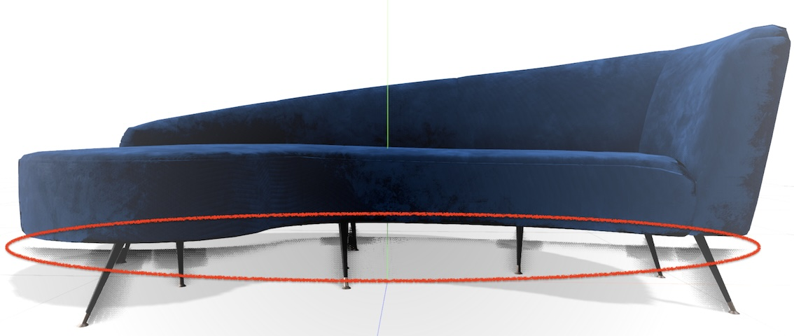

# Notes

## Effects

### Ambient Occlusion

Add `thicknessFalloff` to `ao` pass (`GTAONode`)

Can the AO be applied to the material by setting the `aoMap` and using screen space coordinates to look up the AO value?

## Material

`ShadowMaterial` does not seem to work with the `WebGPURenderer`.
